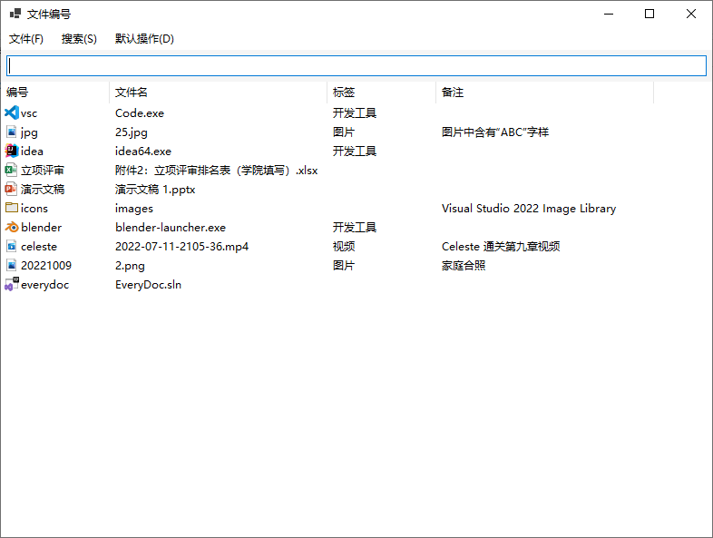
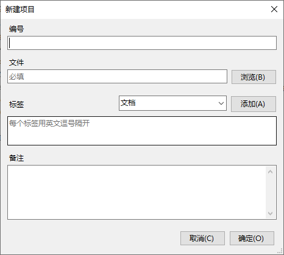
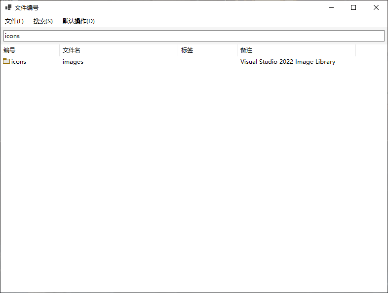
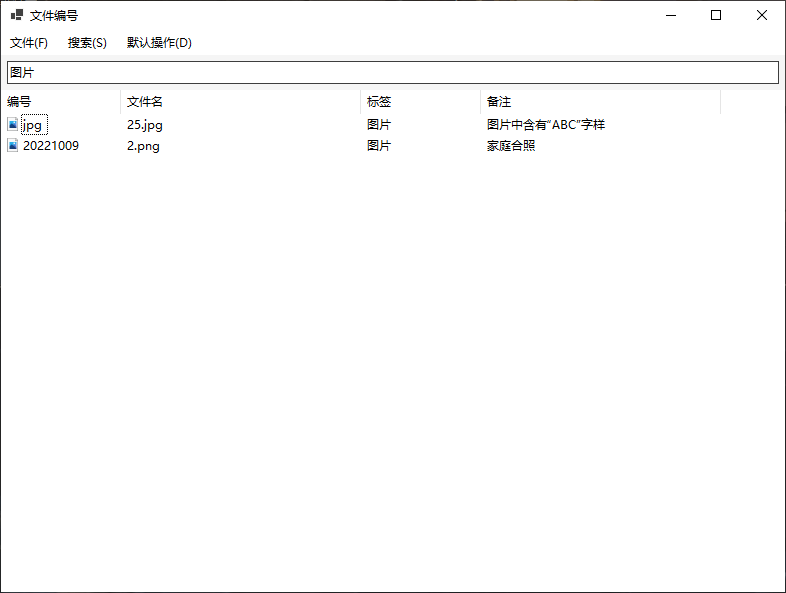
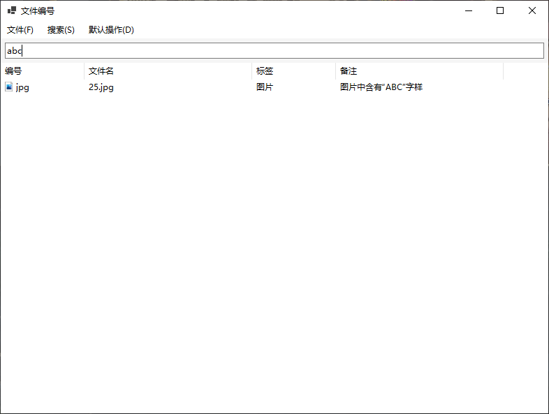

# EveryDoc

可以为文件添加别名、标签和备注，更快找到自己需要的文件。

## 功能

可以将自己容易忘记（无论是忘记文件存放位置还是忘记文件内容）的文件输入到文件编号程序中。并给其编号、打标签或输入备注。以后查找时只需输入任意关键词即可快速找到文件。

例如某个文档通篇都是围绕着“ABC”展开的，但是因为特殊原因文件名不包含“ABC”且已固定不可更改。如果不记得文件存放位置，而且文件名不含“ABC”，如某一天需要找到关于“ABC”的这个文档就会很困难。如果使用文件编号，那么就可以添加这个文件到这个软件中，在编号或者备注中写入“ABC”，这样当下次要找关于“ABC”的这个文档时，就可以打开文件编号，输入“ABC”即可快速找到。

### 支持文件夹

### 支持中文

### 大小写不敏感

### 移动过的文件支持 Everything 搜索

文件编号会在打开指定文件之前检查文件是否存在，如果向文件编号中添加的文件位置发生了移动，检测到文件不存在，就会自动调用 Everything 进行搜索。前提是打开文件编号程序时 Everything 正在运行。

## TODO

* 修复添加项目的浏览文件窗口打开 Internet 快捷方式会提示“灾难性故障”的问题。
* 修复拖放文件时鼠标光标不正常的问题。
* 文件列表增加不同的视图。
* 使用更好的方法去获取文件列表的图标。
* 其它错误修复。
